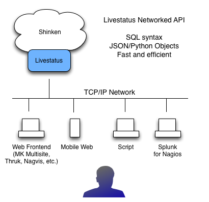

.. image:: https://api.travis-ci.org/mohierf/mod-livestatus.svg?branch=develop
    :target: https://travis-ci.org/mohierf/mod-livestatus
    :alt: Develop branch build status

.. image:: https://api.codacy.com/project/badge/Grade/4ffb2900db7949e98e528a4a9f342d71
    :target: https://www.codacy.com/manual/Shinken_modules/mod-livestatus?utm_source=github.com&amp;utm_medium=referral&amp;utm_content=mohierf/mod-livestatus&amp;utm_campaign=Badge_Grade
    :alt: Development code static analysis

.. image:: https://codecov.io/gh/mohierf/mod-livestatus/branch/develop/graph/badge.svg
    :target: https://codecov.io/gh/mohierf/mod-livestatus
    :alt: Development code tests coverage

=======================
Shinken Livestatus API
=======================

Overview
=========

What is it
-----------

Livestatus API is the modern method of interacting with Shinken and Nagios based systems alike.

Originally developed for Nagios, MK Livetstatus, was re-implemented in Python for use with Shinken by professional developers. The access methods and query languages are the same.

Why use it
-----------

It is fast.

It is network based using TCP.

It is standard for all Nagios and Shinken monitoring systems.

It uses in-memory structures for status data

It uses a back-end database for historical reporting

It uses an SQL based query language

It has a host of powerful nuts and bolts features (authentication, caching, connection persistence, multiple object methods (JSON, Python)).

What can I do with it?
-----------------------

All programs and scripts use (or should use) this method to :

  * Obtain the current state of hosts and services
  * Obtain the current configuration related to hosts and services
  * Send administrative commands (downtimes, comments, forcing checks)
  * Filter information to display
  * Obtain basic reports and event statistics

Shinken being a modern re-implementation of Nagios has additional features that are available in addition to the standard Livestatus API.

Shinken Livestatus API unique features can :
  * Obtain Business Impact information
  * Obtain intelligent dependency status hosts or services (combines dependency and parent information)
  * Obtain Business Process states (same syntax as standard host and service queries)

How does it work
=================

Livestatus uses a powerful SQL-like query language. The standard methods and parameters are defined at :

   `MK Livestatus reference methods and query language definition`_

Full list of Shinken Livestatus API methods:

`Shinken mapping.py methods`_

What software uses Livestatus to interact with Shinken
=======================================================

Well known Web frontends
  * MK Multisite
  * Thruk
  * NagVis
  * Splunk for Nagios

Mobile Web frontends
  * get list

Scripts
  * Downtime management scripts
  * Debug scripts

Installing
----------

Have you installed the required packages to use the Livestatus module? Install, as usual, the mod-livestatus module.

How to enable Livestatus
-------------------------

Very simple, jump to the :ref:`Shinken Broker configuration <the_broker_modules>` section to enable it.

.. _Shinken mapping.py methods: https://github.com/mohierf/mod-livestatus/blob/develop/module/mapping.py
.. _MK Livestatus reference methods and query language definition: http://mathias-kettner.de/checkmk_livestatus.html
